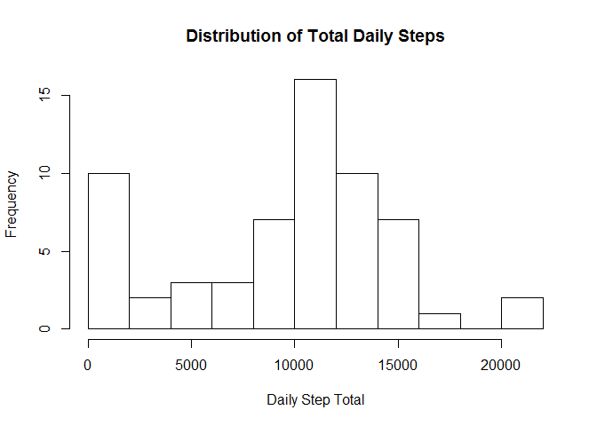
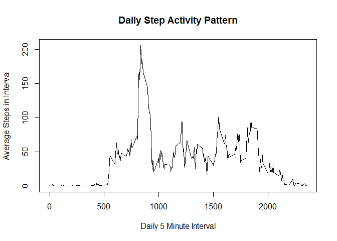
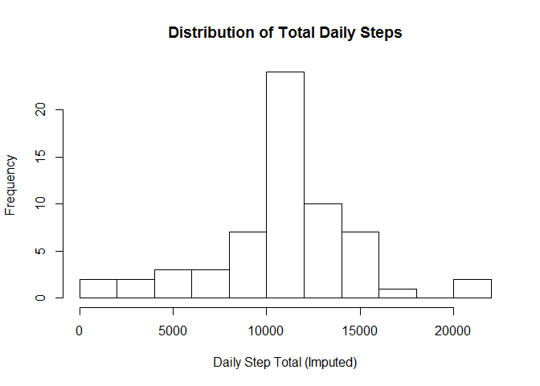
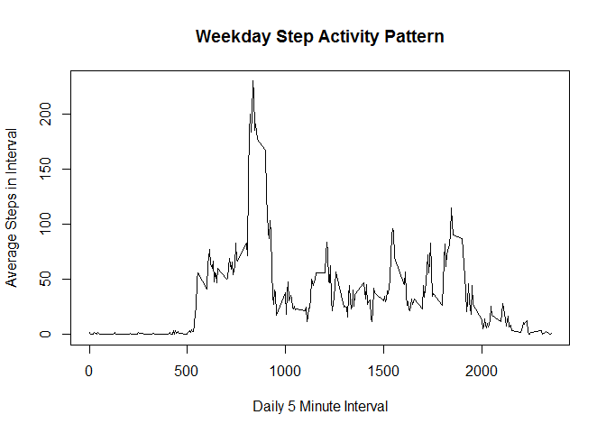
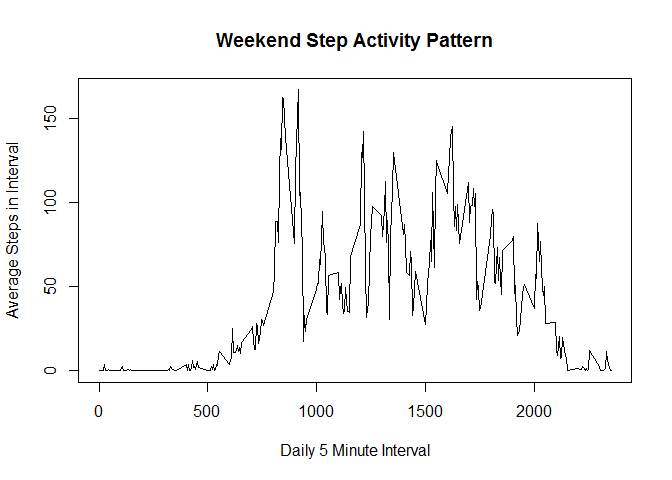

# Reproducable Research Course Project #1
Preston Cody  
July 24, 2017  


The purpose of this report is to demonstrate proficiency in the use of RMarkdown and the libray "knitr" to document analysis performed with the intent to be reproduceable.  There are a series of question the assignment presents to the student to answer based on analysis of *Activity Monitoring Data* provided by the course.  

Step #1 is to load the *Activity Monitoring Data* into a dataframe.  Assuming the source file is available in the working directory, the following instruction loads the data into **actdf**:


```r
actdf <- read.csv(unzip("activity.zip"))
actdf$date <- as.Date(actdf$date, "%Y-%m-%d")
```

*Note: since the date does not read in as a date, it must be converted to an R date format*

##Question #1: What is mean total number of steps taken per day?

First we should get a sense of the distribution of daily steps, which requires that we calculate a step count for each day (using *tapply* to sum the steps per day):

```r
dailysteptotal <- tapply(actdf$steps, actdf$date, sum, na.rm=TRUE)
hist(dailysteptotal, breaks=12, main="Distribution of Total Daily Steps", xlab = "Daily Step Total")
```

<!-- -->

From *dailysteptotal* we calculate the mean and median steps taken per day.


```r
meandailysteps <- mean(dailysteptotal)
mediandailysteps <- median(dailysteptotal)
print(paste("Mean daily steps:",meandailysteps))
```

```
## [1] "Mean daily steps: 9354.22950819672"
```

```r
print(paste("Median daily steps:",mediandailysteps))
```

```
## [1] "Median daily steps: 10395"
```

##Question #2: What is the average daily activity pattern?

The dataset includes a factor variable representing every 5 minute interval in a day.  Using this variable to summarize the data will give us a sense of the amount of steps taken at that time of day, producing a daily pattern.  

*Note: some many intervals are missing data (NA) which is addressed by the next question.  So for this question, we will assume that we can ignore/remove the NA values.


```r
intervalavgnarm <- tapply(actdf$steps, actdf$interval, mean, na.rm=TRUE)
plot(names(intervalavgnarm), intervalavgnarm, type="l", main="Daily Step Activity Pattern", xlab = "Daily 5 Minute Interval", ylab="Average Steps in Interval")
```

<!-- -->

```r
maxinterval <- which.max(intervalavgnarm)
print(paste("max 5 minute interval:", names(maxinterval), "=", intervalavgnarm[maxinterval]))
```

```
## [1] "max 5 minute interval: 835 = 206.169811320755"
```

From the daily activity pattern line plot, it is clear the maximum average interval occurs between 500 and 1000, closer to 1000.  From the *max* calculation the maximum occurred during interval 835 with a value of about 206.

## Question 3: Imputing missing values

Unfortunately there are missing values in the original dataset.


```r
missingvalues <- sum(is.na(actdf$steps))
print(paste("Count of missing values =", missingvalues))
```

```
## [1] "Count of missing values = 2304"
```

We can fill these in arbitrarily using the mean values for each interval.  This information is already calculated in the variable **intervalavgnarm**, which can be used to fill in the missing values of a new data frame created called **imputedstepsdf**.


```r
library(dplyr)
```

```
## Warning: package 'dplyr' was built under R version 3.3.3
```

```
## 
## Attaching package: 'dplyr'
```

```
## The following objects are masked from 'package:stats':
## 
##     filter, lag
```

```
## The following objects are masked from 'package:base':
## 
##     intersect, setdiff, setequal, union
```

```r
imputedstepsdf <- actdf %>% group_by(interval) %>% mutate(steps = replace(steps, is.na(steps), mean(steps,na.rm=TRUE)))
```

From the filled in dataset, we recalculate the total number of steps taken each day and plot as a histogram.  We also get new values for mean and median steps per day.


```r
imputeddailysteptotal <- tapply(imputedstepsdf$steps, imputedstepsdf$date, sum)
hist(imputeddailysteptotal, breaks=12, main="Distribution of Total Daily Steps", xlab = "Daily Step Total (Imputed)")
```

<!-- -->

```r
meanimputeddailysteps <- mean(imputeddailysteptotal)
medianimputeddailysteps <- median(imputeddailysteptotal)
print(paste("Mean imputed daily steps:",meanimputeddailysteps))
```

```
## [1] "Mean imputed daily steps: 10766.1886792453"
```

```r
print(paste("Median imputed daily steps:",medianimputeddailysteps))
```

```
## [1] "Median imputed daily steps: 10766.1886792453"
```

Interestingly, because we have replaced missing values with mean values, there are now many more observations at that mean value in the middle of the distribution.  This has caused the median to fall on one of those mean observations and the two metrics are now equal.

## Question 4: Are there differences in activity patterns between weekdays and weekends?

To answer this question, each element is tagged with whether it is a weekday or weekend by adding a variable to the imputed data frame called **day_type**.  With this variable, the average number of steps can be calculated   And this can be plotted with the activity grouped by the day type.


```r
imputedstepsdf <- imputedstepsdf %>% group_by(date) %>% mutate(day_type = ifelse(weekdays(date) %in% c("Sunday","Saturday"), "weekend", "weekday"))
avgstepsbydaytype <- imputedstepsdf %>% group_by(day_type, interval) %>% summarize(avg_steps= mean(steps))

## Note: new security software installed by my company was blocking R from loading packages, so could not use lattice or ggplot2 for the panel plot
weekdaysteps <- avgstepsbydaytype %>% filter(day_type == "weekday")
weekendsteps <- avgstepsbydaytype %>% filter(day_type == "weekend")

plot(weekdaysteps$interval, weekdaysteps$avg_steps, type="l", main="Weekday Step Activity Pattern", xlab = "Daily 5 Minute Interval", ylab="Average Steps in Interval")
```

<!-- -->

```r
plot(weekendsteps$interval, weekendsteps$avg_steps, type="l", main="Weekend Step Activity Pattern", xlab = "Daily 5 Minute Interval", ylab="Average Steps in Interval")
```

<!-- -->

